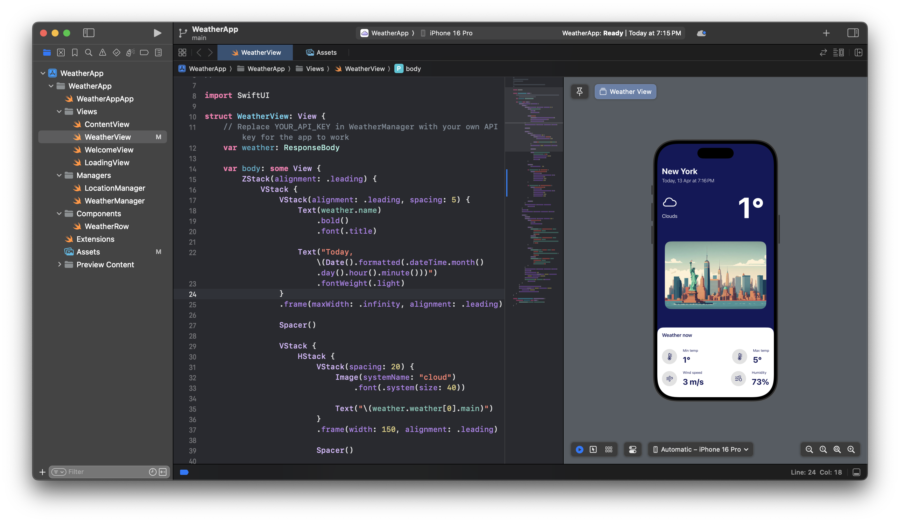
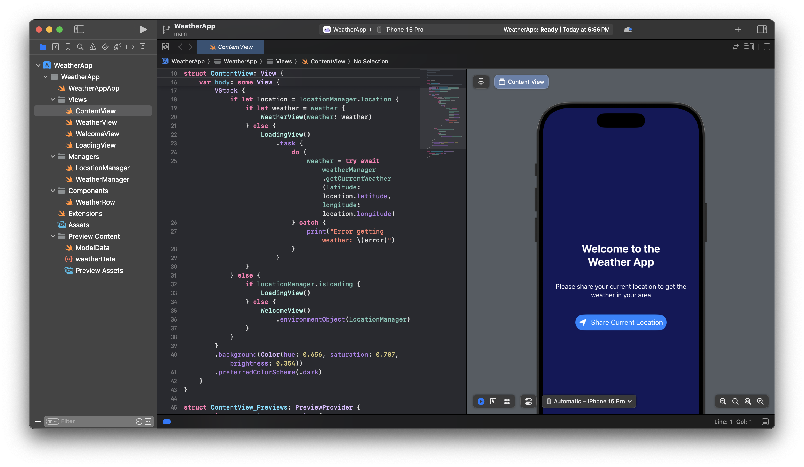

# 🌦 iOS Weather App

An elegant, real-time weather app built entirely using **Swift** and **SwiftUI**, leveraging Apple's latest technologies like **CoreLocation** and **async/await** introduced in **WWDC 2024**.

---

## 📱 App Screenshots

### 🖼️ `WeatherView.swift`


### 🖼️ `WelcomeView.swift`


### 📱 Weather Screen (After Location is Fetched)


### 📱 Welcome Screen (Before Location is Fetched)


### 🧭 `LocationManager.swift`


### 🌤 `WeatherManager.swift`


---

## 💡 Features

- 🌍 Fetches **real-time location** using CoreLocation
- 📡 Retrieves live weather data from **OpenWeather API**
- ⚡ Built with **async/await** for clean, non-blocking network calls
- 📲 Fully built using **SwiftUI** with a responsive and intuitive interface
- 🎯 Uses a modular architecture for scalability and clarity

---

## 🔧 Technologies Used

| Tool             | Purpose                                 |
|------------------|------------------------------------------|
| Swift            | Core programming language                |
| SwiftUI          | Declarative UI framework                 |
| CoreLocation     | Location permission and coordinates      |
| Async/Await      | Asynchronous network calls               |
| OpenWeather API  | Weather data                             |
| MVVM Architecture| Clean separation of concerns             |

---

## 🧩 App Architecture

### 🧭 `LocationManager.swift`  
Handles real-time location permissions and coordinates using the **CoreLocation** framework.

### 🌤 `WeatherManager.swift`  
Fetches weather data using the **OpenWeather API** with Swift’s modern `async/await`. Parses JSON using `Codable`.

### 📲 `ContentView.swift`  
Acts as the main entry point. Manages app state, shows loading or content views, and triggers weather fetch using `.task {}`.

### 🖼️ WeatherView.swift, WelcomeView.swift  
SwiftUI views that:
- Show weather info
- Prompt user for location access
- Handle fallback UI scenarios

---

## 📦 Setup Instructions

1. **Clone the repository**
   ```bash
   git clone https://github.com/yourusername/ios-weather-app.git
